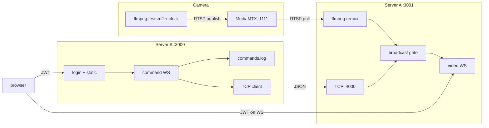
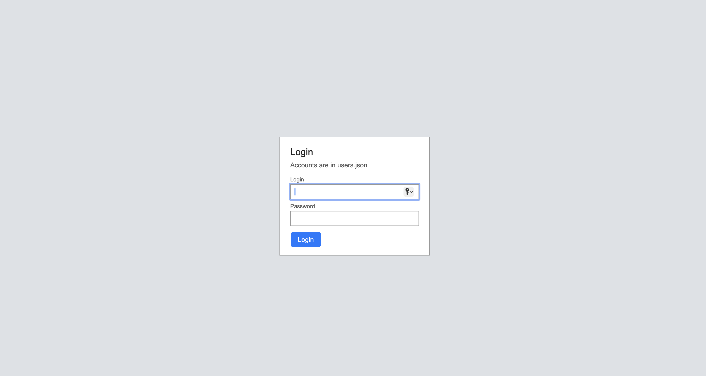
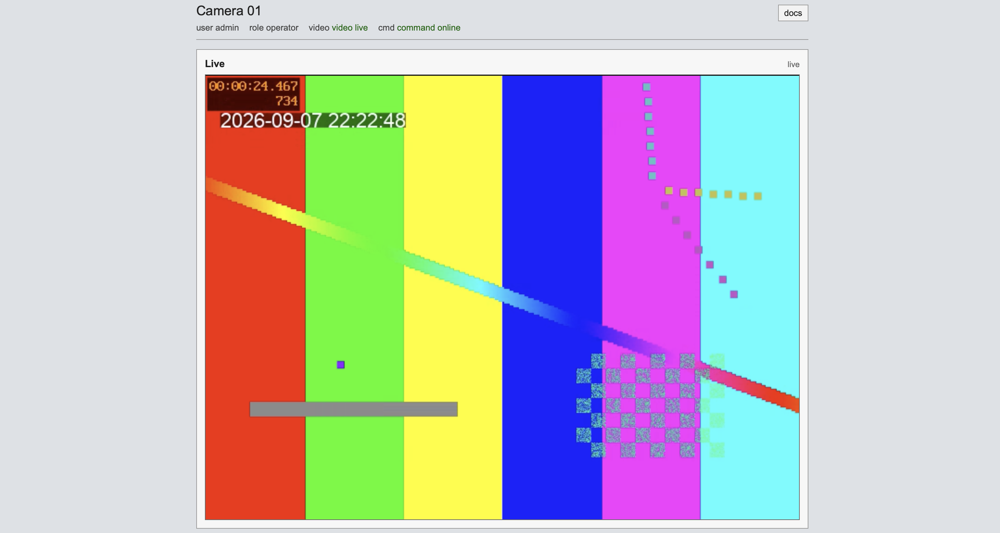
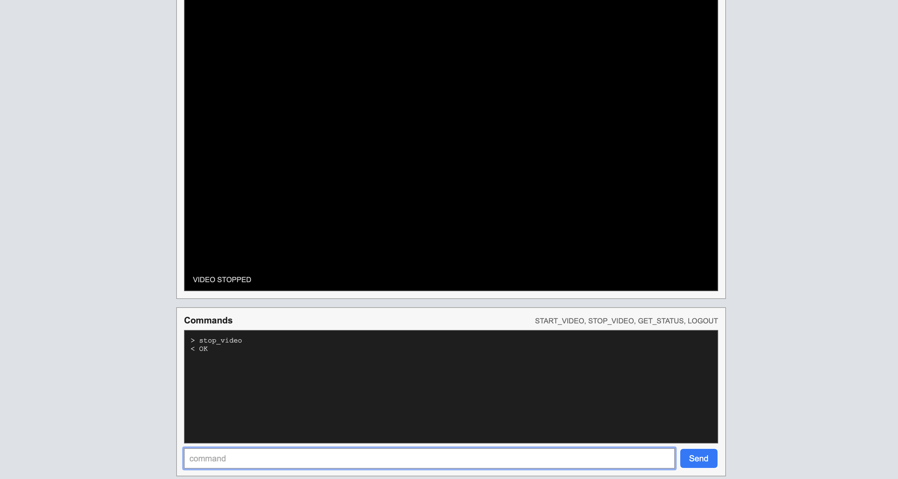
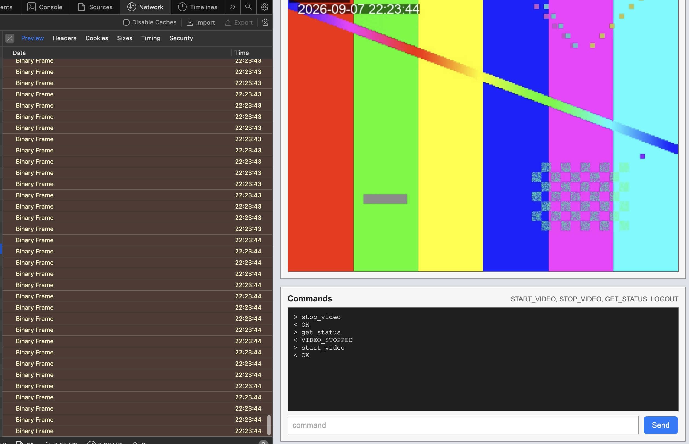

# Solution notes

Same content as the in-app docs page at /docs.

Quick notes for the surveillance prototype - RTSP camera sim, Server A (video), Server B (auth/commands), browser client. Video is MPEG-TS over WebSocket + mpegts.js.

## Architecture

## Tech

- Node (ESM) - whole thing is plain JS
- MediaMTX - owns rtsp://127.0.0.1:1111/camera
- ffmpeg-static - camera + remux (works on mac/win without installing ffmpeg by hand)
- MPEG-TS / mpegts.js - browser playback, no plugin, copy remux (no 2nd encode)
- Express + ws - HTTP + sockets
- JWT + bcrypt - login / session
- length-prefixed TCP between A and B (no REST there)

Skipped HLS (too laggy) and WebRTC (more moving parts than I wanted for START/STOP). Transport delay is small; most of what you see is the player buffer.

## Performance

Localhost, 640x480 @ 30fps. Transport delay is small; most of what you see is the player buffer.

- time to first WS byte - a few ms
- preroll on connect - about 1.5 s
- camera -> client bytes (clock overlay) - about 1 frame (30-40 ms)
- what you see on screen - mostly mpegts.js buffer (around 0.15-0.5 s)

## Setup

1. Node 20+
2. npm install
3. npm start (downloads MediaMTX first time)
4. open http://127.0.0.1:3000
5. login example: admin / admin123

Also: operator / operator123, viewer / viewer123. Ports: RTSP 1111, B 3000, A 3001, control 4000.

## Decisions / gotchas

- :1111 - MediaMTX listens; ffmpeg only publishes (sample command assumes an RTSP server is already there).
- ffmpeg.exe - used ffmpeg-static instead so mac + windows both work.
- STOP_VIDEO - does not kill ffmpeg. Just stops forwarding chunks. Still read stdout.
- Auth on video - Server A checks JWT on upgrade. Hiding the URL isn't enough.
- Bonus A - viewer vs operator on Server B. viewer can't START/STOP.
- Bonus B - commands encrypted with RSA-OAEP. Public key at GET /crypto/public-key. Plaintext rejected.
- GET_STATUS - JSON from A, UI prints VIDEO_RUNNING / VIDEO_STOPPED.
- Reconnect A->B, B->A - B is the TCP client, backoff + replay revoked jtis.
- Clock on video - testsrc2 has its own timer; drawtext adds wall clock if a font is around.
- Log HMAC - each commands.log line is chained with HMAC-SHA256. Check with npm run verify-log.

## Limitations

- No Bonus C/D (native addon / TPM).

## Screenshots

Login:

Live stream (testsrc2 clock overlay):

STOP_VIDEO - ffmpeg stays up, UI just stops showing frames:

Commands plus the video WebSocket (binary MPEG-TS frames):

